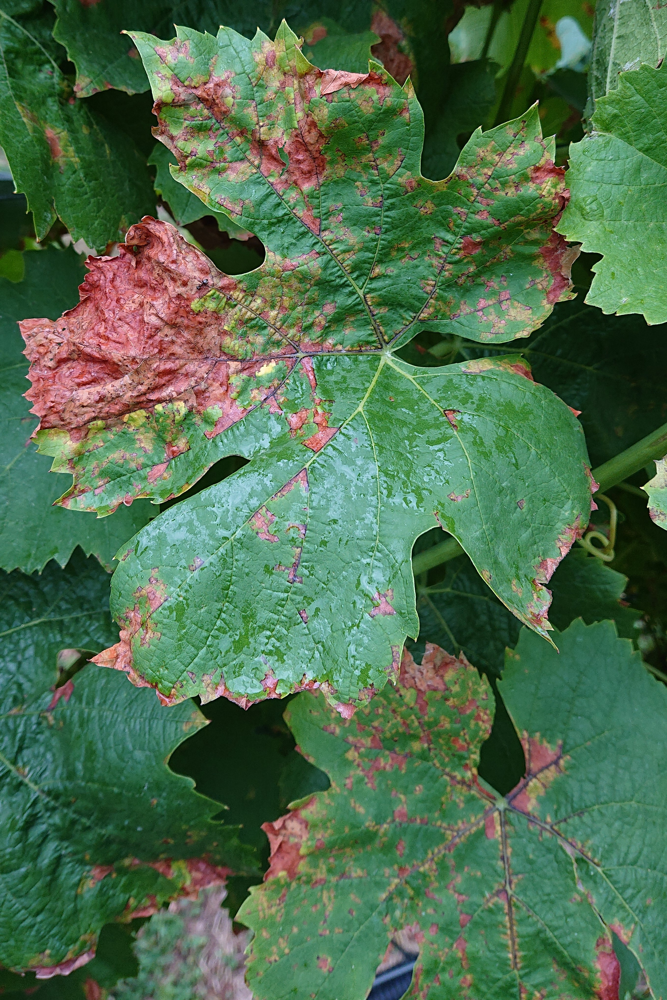
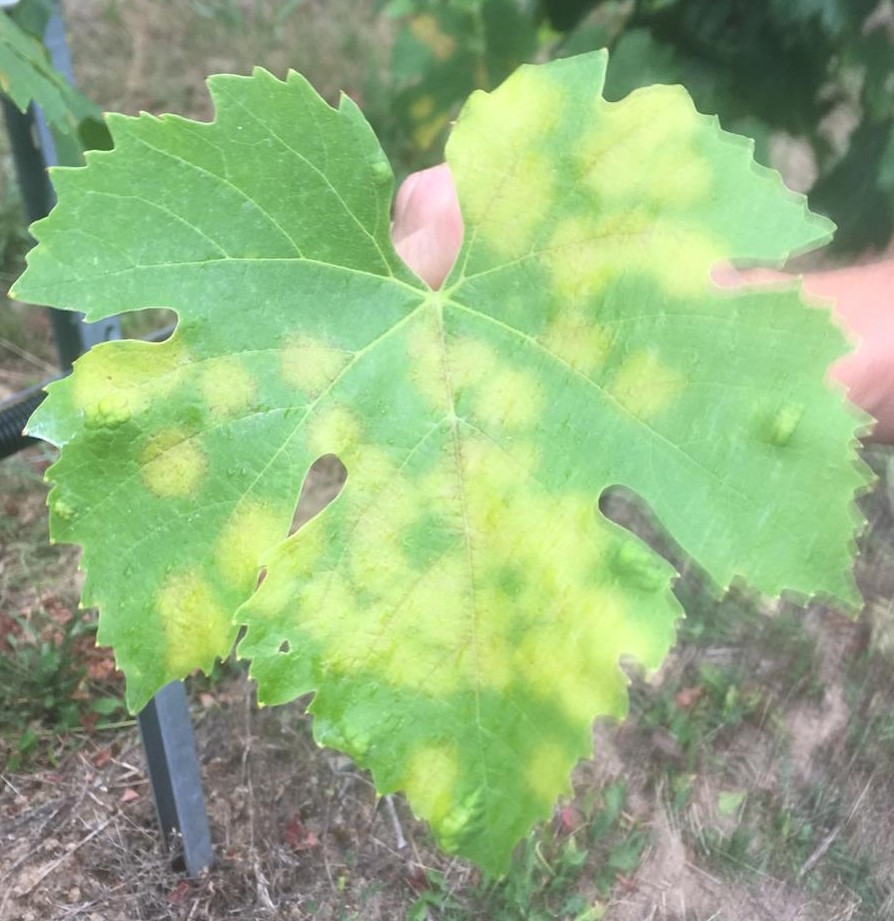
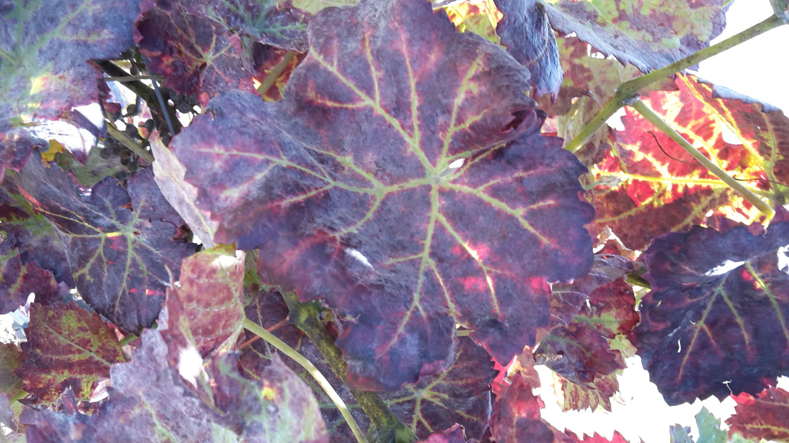
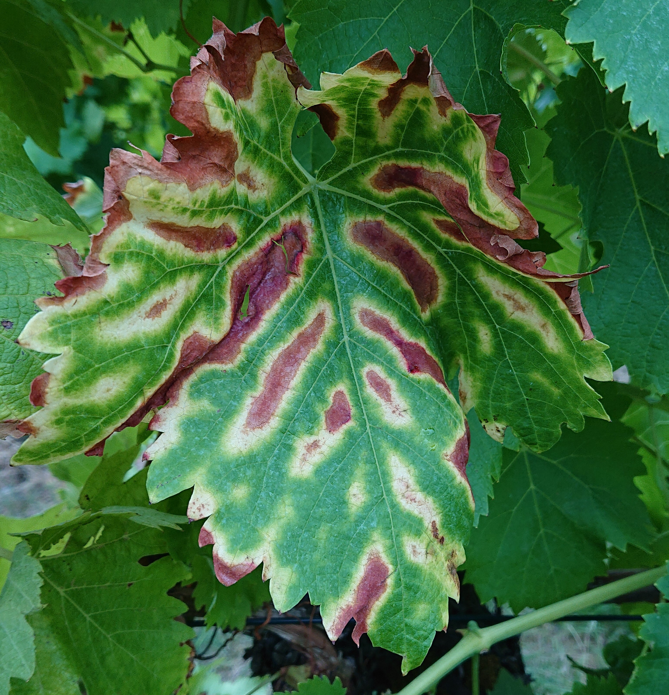
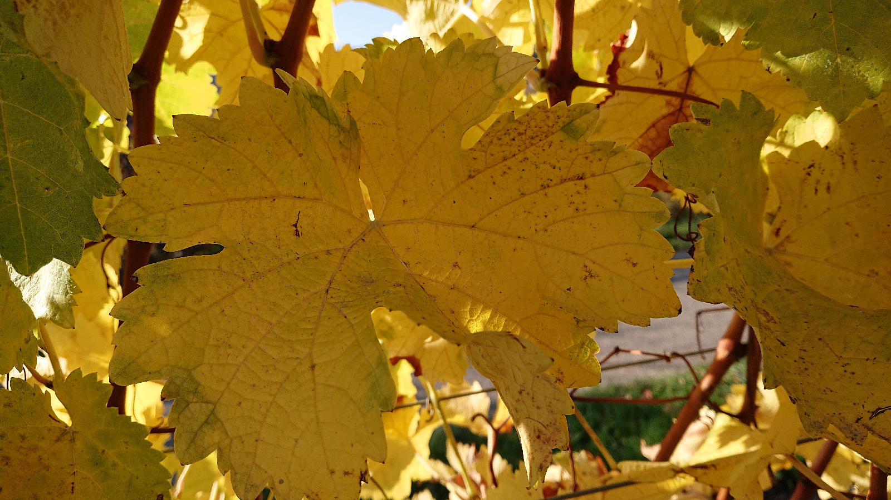
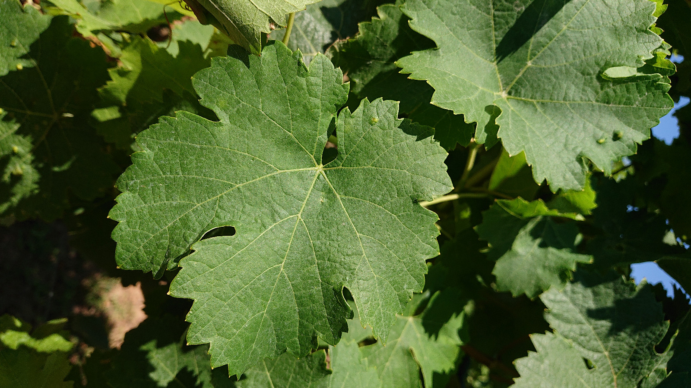

# Different vine leaf diseases

Wir konzentrieren uns zunächst auf die wichtigsten Weinblattkrankheiten. Im Folgenden werden wir genauere Informationen zu den von uns benutzten Krankheiten geben.

1. Echter Mehltau (Erysiphaceae)
2. Falscher Mehltau (Plasmopara viticola)
3. Schwarzholzkrankheit (Bois noir)
4. Esca-Krankheit

Außerdem unterscheidet die KI zusätzlich zwischen:

5. Roter/Gelber Herbstfärbung
6. Gesundes Weinblatt

## Echter Mehltau

Wissenschaftlicher Begriff:	Erysiphaceae, Erysiphe necator, Oidium

Gattung bzw. Abteilung:	Schlauchpilze (Ascomycota), Unterabteilung, Echte Schlauchpilze (Pezizomycotina)

Merkmale:	Es bilden sich weiß-graue Flecken und netzartige Strukturen, vergleichbar mit Spinnweben auf und unter den Blättern. Die sich bildende Schicht auf dem Blatt wirkt leicht schimmlig und mehlig.

Folgen:	Als Folge auf die Krankheit rollen sich oft die Blätter ein, die Blüten können sich nichtmehr öffnen und die Früchte werden hart, färben sich grau bis schwarz, schließlich kann es auch zu einem Samenbruch kommen und die Trauben sind somit nichtmehr zum Verzehr geeignet. Außerdem wird das Wachstum eingeschränkt und die Pflanze geht ein.

Ausbreitung:	Durch den Wind werden die Sporen weitergetragen und die Krankheit verbreitet

## Falscher Mehltau
Wissenschaftlicher Begriff: Plasmopara viticola, Peronospora

Gattung bzw. Abteilung: Scheinpilz, Eipilze (Oomycota)

Merkmale: Es bilden sich leicht violette oder weiß-graue mehlige Beläge an der Blattunterseite. Auf der Blattoberseite sind entweder Ölflecken oder rot gefärbte Flächen (siehe Bild) sichtbar.

Folgen: Die Folge auf dem Befall ist ein welken und eingehen der Blätter und schließlich der ganzen Weinrebe. Auch die Trauben sind dann nichtmehr für den Verzehr geeignet.

Ausbreitung: Durch den Wind werden die Sporen weitergetragen und die Krankheit verbreitet

## Schwarzholzkrankheit

Wissenschaftlicher Begriff: Bois noir, Candidatus Phytoplasma solani

Gattung bzw. Abteilung: Candidatus Phytoplasma (zellwandlose Bakterien)

Merkmale: Während eine rötliche bis lila Färbung der Blätter bei rotblättrigen Sorten Symptom für die Schwarzholzkrankheit ist, färben sich die Blätter bei weißen Rebsorten hellgrün bis gelblich.

Folgen: Das Einrollen der Blätter ist eine Folge des Befalls. Die Beeren haben einen unreifen und bitteren Geschmack, welche sie für den Konsum „nutzlos“ werden lässt.

Ausbreitung: Die Krankheit befindet sich in den Saftleitbahnen der Rebe und erfolgt somit über einen Vektor (Überträger) z.B. durch Zikaden aber auch durch Pfropfung.

## Esca

Wissenschaftlicher Begriff: Esca-Krankheit

Gattung bzw. Abteilung: Omitiporia, Phaeomoniella, Phaeoacremonium, Abteilung Schlauchpilze

Merkmale: Das wohl offensichtlichste Merkmal der Esca-Krankheit an Weinreben sind die Tigerstreifen auf den Blättern. Die Blattadern sind dabei meist entweder von einem gelben oder von einem roten Saum umlagert. Ein weiteres Symptom kann ihre gelbe Färbung sein, welche durch die Krankheit bereits im Sommer eintritt.

Folgen: Die Blätter vertrocknen und fallen in Folge des Befalls ab. Auch die Trauben schrumpfen ein und färben sich braun, ähnlich Lederbeeren und springen auf. Insgesamt ist eine Vertrocknung und das Absterben des Rebstocks zu verzeichnen.

Ausbreitung: Durch den Wind werden die Sporen weitergetragen und die Krankheit verbreitet

Ein typischer Indikator für die Esca Krankheit sind die Tigerstreifen. Das gestreifte Muster entsteht durch die Verbindung von bräunlichen und hellen/grünlichen Elementen und erinnert an das das Fell eines Tigers. Die Weinbeeren fallen meist klein aus und färben sich schwarz.
Die Krankheit tritt gehäuft ab circa Juni auf und die Pilze befallen die Pflanze meist durch Schäden im Holz.
Resultat ist das Absterben von Blättern, Beeren und des gesamten Rebstockes. Bisher gibt es noch keine zugelassene und zuverlässige Bekämpfungsmethode, aber im Rahmen der Schadensbegrenzung ist es essenziell, die Esca Krankheit früh zu erkennen und den Befall schnellstmöglich lokal zu entfernen, um ein weiteres Ausbreiten zu verhindern.
Die „Vine Leaf Disease and AI“ App ermöglicht das Verfolgen und das Erkennen von lokalen Ausbreitungen über den Menüpunkt „Trend“.

[Quelle](https://www.iva.de/iva-magazin/forschung-technik/die-esca-krankheit-breitet-sich-aus)

## Rote/Gelbe Herbstfärbung

## Gesundes Weinblatt

| [Generelle Projektinformationen](https://matheli.github.io/Vine-leaf-diseases-and-AI/) | [Die verschiedenen Krankheiten](https://matheli.github.io/Vine-leaf-diseases-and-AI/Different-diseases) | [Die App](https://matheli.github.io/Vine-leaf-diseases-and-AI/App) | [Der Code des Modells Teil 1](https://matheli.github.io/Vine-leaf-diseases-and-AI/Code) | [Der Code des Modells Teil 2](https://matheli.github.io/Vine-leaf-diseases-and-AI/Code2) | [Image Preprocessing](https://matheli.github.io/Vine-leaf-diseases-and-AI/ImagePreprocessing) | [Sonstige Informationen](https://matheli.github.io/Vine-leaf-diseases-and-AI/Sonstiges) | [Umfrage](https://matheli.github.io/Vine-leaf-diseases-and-AI/Survey) | [The Team](https://matheli.github.io/Vine-leaf-diseases-and-AI/Team) | [Der Betriebsschlüssel](https://matheli.github.io/Vine-leaf-diseases-and-AI/Betriebsschl%C3%BCssel) | [Interviews mit den Weinköniginnen](https://matheli.github.io/Vine-leaf-diseases-and-AI/Interviews)| [Datenschutzerklärung](https://matheli.github.io/Vine-leaf-diseases-and-AI/Datenschutzerklärung) | [Impressum](https://matheli.github.io/Vine-leaf-diseases-and-AI/Impressum) |

